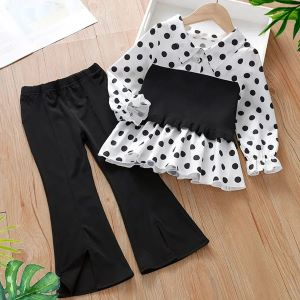

# MDS eFashion Store

This project is a simple frontend fashion store website, built using **HTML**, **CSS**, and **images**. It showcases a stylish and responsive design for a modern e-commerce platform.

## Features
- **Homepage Design:** A static homepage with a clean and modern layout.
- **Product Gallery:** Display of fashion items with styled product cards.
- **Responsive Design:** Optimized for different screen sizes.
- **Image Integration:** High-quality images to enhance the user experience.

## Technologies Used
- **HTML**: Provides the structure of the web pages.
- **CSS**: Styles the pages with layouts, colors, and fonts.
- **Images**: Adds visual appeal and context to the content.

## Usage
1. Clone the repository:
   ```bash
   git clone https://github.com/yourusername/MDSefashionstore.git
   ```
2. Navigate to the project directory:
   ```bash
   cd MDSefashionstore
   ```
3. Open `index.html` in your preferred browser to view the project.

## Screenshots
### Homepage


### Product Gallery


## Future Enhancements
- Add interactivity using JavaScript for dynamic behavior.
- Include backend integration for a complete e-commerce experience.

## Contributing
Contributions are welcome! Feel free to fork the repository and submit pull requests with improvements.

## Disclaimer
This project is for educational purposes only and is not affiliated with any fashion brands or retailers.
